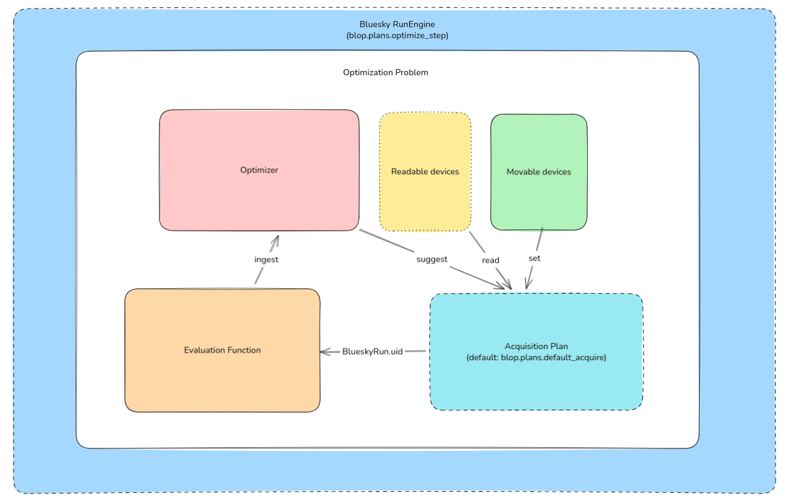

Protocols for Optimization
==========================

Blop provides a set of protocols which enable users to define their own optimization workflows. These protocols are designed to be compatible with the `Bluesky <https://blueskyproject.io>`_ ecosystem, and are therefore compatible with the Bluesky RunEngine.

There are three main protocols:

- :class:`blop.protocols.Optimizer`: A protocol for defining an optimizer. How to suggest points to evaluate and ingest outcomes to inform the optimization.
- :class:`blop.protocols.EvaluationFunction`: A protocol for transforming acquired data into measurable outcomes.
- :class:`blop.protocols.AcquisitionPlan`: An optional protocol for defining an acquisition plan. I.e. how to acquire data from the beamline.

The :class:`blop.protocols.OptimizationProblem` encapsulates all of these components into an immutable structure that can be used with specific optimization-focused
Bluesky plans. Immutability is important to ensure that the optimization problem is not modified after it has been created or used!

.. note:: For a full API reference, see :doc:`../reference/protocols`.

Data Flow
---------

The data flow for a typical optimization workflow is as follows:

1. The optimizer suggests a set of points to evaluate.
2. The acquisition plan is used to acquire data from the beamline.
3. The evaluation function is used to transform the acquired data into outcomes.
4. The outcomes are ingested by the optimizer to inform future suggestions.

The Bluesky RunEngine is used to execute each optimization workflow step (:func:`blop.plans.optimize` and :func:`blop.plans.optimize_step`). Currently, these plans are compatible with any ``NamedMovable`` or ``Readable`` devices or classes that implement these Bluesky protocols. For example, `Ophyd <https://github.com/bluesky/ophyd>`_ devices and signals can be used directly with Blop since they implement both the ``NamedMovable`` and ``Readable`` protocols.

.. note:: We are currently working on adding support for other Bluesky protocols to enable more flexible and powerful optimization workflows, such as the ``Flyable`` protocol for fly-scanning acquisition plans.

Blop optimizers and acquisition plans
-------------------------------------

This protocol design allows you to pick and choose only the components you care about with regard to your optimization workflow. While Blop provides a default optimizer and acquisition plan, you are free to implement your own!

Blop provides built-in optimizers for common beamline optimization use cases, such as Bayesian optimization with `Ax <https://ax.dev>`_.

Similarly, Blop provides a :func:`blop.plans.default_acquire` acquisition plan that is compatible with most beamline optimization use cases.
