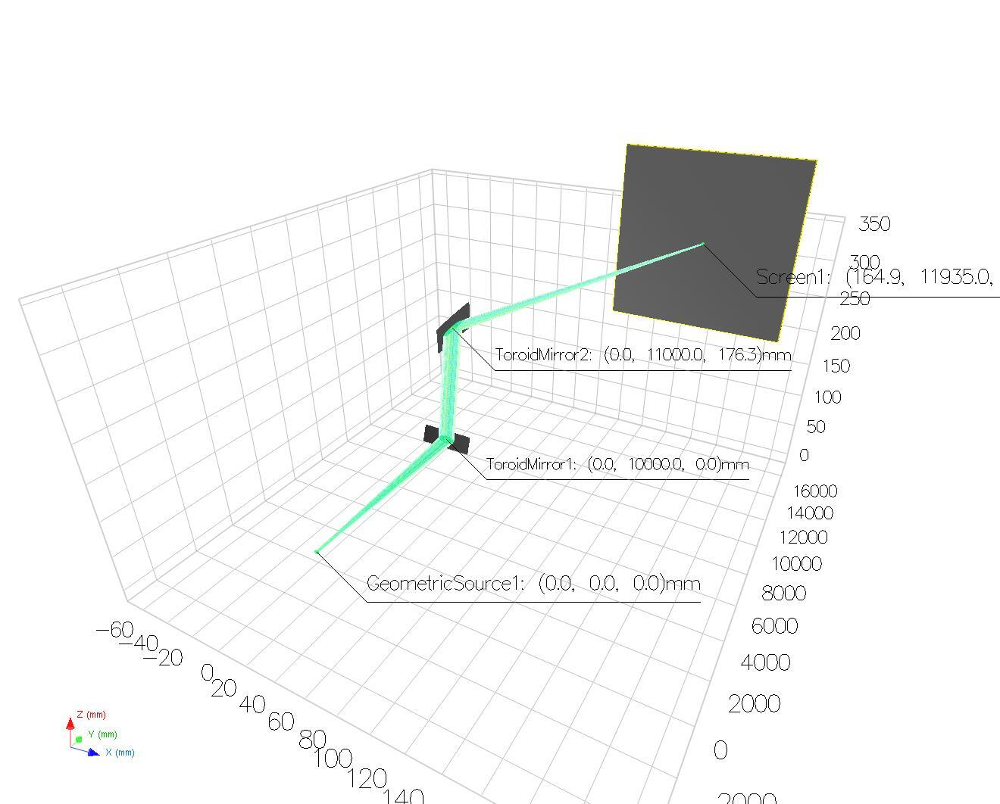

---
jupytext:
  text_representation:
    extension: .md
    format_name: myst
    format_version: 0.13
    jupytext_version: 1.17.3
kernelspec:
  display_name: dev
  language: python
  name: python3
---

# XRT KB Mirror Demo

+++

For ophyd beamline setup see: 
- https://github.com/NSLS-II/blop/blob/main/src/blop/sim/xrt_beamline.py
- https://github.com/NSLS-II/blop/blob/main/src/blop/sim/xrt_kb_model.py

The picture below displays beam from geometric source propagating through a pair of toroidal mirrors focusing the beam on screen. Simulation of a KB setup.



```{code-cell} ipython3
import logging

import matplotlib.pyplot as plt
from tiled.client.container import Container
from bluesky.callbacks import best_effort
from bluesky.callbacks.tiled_writer import TiledWriter
from bluesky.run_engine import RunEngine
from tiled.client import from_uri  # type: ignore[import-untyped]
from tiled.server import SimpleTiledServer

from blop.ax import Agent, RangeDOF, Objective
from blop.sim.xrt_beamline import TiledBeamline
from blop.protocols import EvaluationFunction

# Suppress noisy logs from httpx 
logging.getLogger("httpx").setLevel(logging.WARNING)

DETECTOR_STORAGE = "/tmp/blop/sim"
```

```{code-cell} ipython3
tiled_server = SimpleTiledServer(readable_storage=[DETECTOR_STORAGE])
tiled_client = from_uri(tiled_server.uri)
tiled_writer = TiledWriter(tiled_client)
bec = best_effort.BestEffortCallback()
bec.disable_plots()

RE = RunEngine({})
RE.subscribe(bec)
RE.subscribe(tiled_writer)
```

```{code-cell} ipython3
plt.ion()

h_opt = 0
dh = 5

R1, dR1 = 40000, 10000
R2, dR2 = 20000, 10000
```

```{code-cell} ipython3
beamline = TiledBeamline(name="bl")

dofs = [
    RangeDOF(movable=beamline.kbv_dsv, bounds=(R1 - dR1, R1 + dR1), parameter_type="float"),
    RangeDOF(movable=beamline.kbh_dsh, bounds=(R2 - dR2, R2 + dR2), parameter_type="float"),
]
```

```{code-cell} ipython3
objectives = [
    Objective(name="bl_det_sum", minimize=False),
    Objective(name="bl_det_wid_x", minimize=True),
    Objective(name="bl_det_wid_y", minimize=True),
]
```

```{code-cell} ipython3
class DetectorEvaluation(EvaluationFunction):
    def __init__(self, tiled_client: Container):
        self.tiled_client = tiled_client
    
    def __call__(self, uid: str, suggestions: list[dict]) -> list[dict]:
        outcomes = []
        run = self.tiled_client[uid]
        bl_det_sum = run["primary/bl_det_sum"].read()
        bl_det_wid_x = run["primary/bl_det_wid_x"].read()
        bl_det_wid_y = run["primary/bl_det_wid_y"].read()

        # These ids are stored in the start document's metadata when
        # using the `blop.plans.default_acquire` plan.
        # You may want to store them differently in your experiment when writing
        # your a custom acquisiton plan.
        suggestion_ids = run.metadata["start"]["blop_suggestion_ids"]

        for idx, sid in enumerate(suggestion_ids):
            outcome = {
                "_id": sid,
                "bl_det_sum": bl_det_sum[idx],
                "bl_det_wid_x": bl_det_wid_x[idx],
                "bl_det_wid_y": bl_det_wid_y[idx],
            }
            outcomes.append(outcome)
        return outcomes
```

```{code-cell} ipython3
agent = Agent(
    readables=[beamline.det],
    dofs=dofs,
    objectives=objectives,
    evaluation=DetectorEvaluation(tiled_client),
    name="xrt-blop-demo",
    description="A demo of the Blop agent with XRT simulated beamline",
    experiment_type="demo",
)
```

```{code-cell} ipython3
# Number of iterations can be increased to be more specific
RE(agent.optimize(30))
```

```{code-cell} ipython3
_ = agent.plot_objective(x_dof_name="bl_kbh_dsh", y_dof_name="bl_kbv_dsv", objective_name="bl_det_sum")
```

## Visualizing the optimal beam

Below we get the optimal parameters, move the motors to their optimal positions, and observe the resulting beam.

```{code-cell} ipython3
optimal_parameters = next(iter(agent.ax_client.get_pareto_frontier()))[0]
optimal_parameters
```

```{code-cell} ipython3
from bluesky.plans import list_scan

scan_motor_params = []
for motor in [beamline.kbv_dsv, beamline.kbh_dsh]:
    scan_motor_params.append(motor)
    scan_motor_params.append([optimal_parameters[motor.name]])
uid = RE(list_scan([beamline.det], *scan_motor_params))
```

```{code-cell} ipython3
import matplotlib.pyplot as plt

image = tiled_client[uid[0]]["primary/bl_det_image"].read().squeeze()
plt.imshow(image)
plt.colorbar()
plt.show()
```
